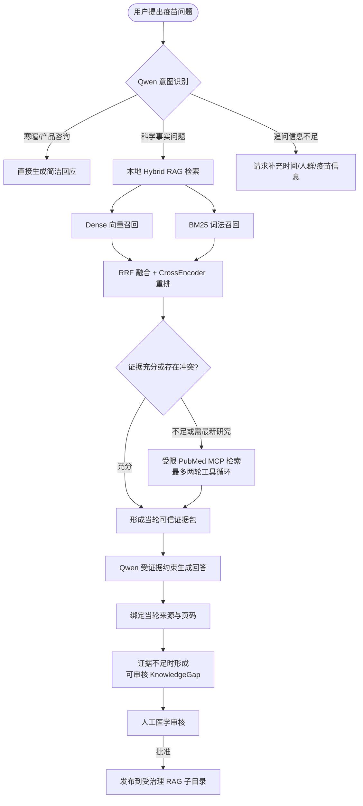
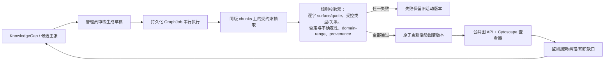

# 疫苗防线：可追溯的疫苗科普与交互表达平台

面向"挑战杯"科学传播方向的可演示全栈项目：以受治理的本地 RAG 与受限 PubMed 核验支撑疫苗问答，将抽象免疫机制转化为科学图解、互动闯关与公共卫生模拟，并通过人工审核与版本化知识图谱形成可追溯的知识更新闭环。

> 📋 **能力边界：** 本项目用于健康科普与科学传播，不提供个体化诊疗或接种决策；具体接种安排以当地疾控机构与专业人员最新建议为准。GraphRAG 已启用（`GRAPH_RAG_ENABLED=true`）：140 份受治理语料文档（125 PDF + 11 MD + 4 DOCX）构建为 17,167 个 chunks，活动图谱版本含 8,006 节点、6,215 边、5,282 条 provenance；图缺失或版本不匹配时问答自动回退 Vector-only。视频页为本地模拟交互，不宣称真实视频生成。

---

## 一、五个模块、五个闭环

系统不是"模型回答 + 页面展示"的拼接，而是五个可独立审查、彼此衔接的闭环：证据不足不硬答，生成结果不直接采信，知识更新必须经人工审核与原子发布。

### 1. 问答闭环（问题 → 检索 → 证据评估 → 回答与来源）



要点：

- 主回答只能基于**当轮独立 V2 检索**，改写 query 与历史消息不得充当医学证据；
- `sources` 只能来自当轮本地检索或外部 PubMed，PDF 页码为 1-based，无证据时返回空数组；
- 证据不足且 PubMed 无结果时返回受限初步科普，不捏造剂次、年龄、禁忌或来源。

### 2. 图解闭环（科学 brief → Wan 生成 → 视觉审查 → 局部编辑）

用户主题先由 Qwen 整理为受约束的中文科学简报（对象、机制、因果链、标注），再交 Wan 生成；输出经视觉 critic 审查文字、结构与科学表达，用户可确认采用，或提交受 bbox 范围守护的局部修改（模型只见外扩裁剪，只有向内羽化的用户 bbox 可写，回贴时越界像素被拒绝）。

### 3. 互动闭环（免疫闯关 + 公共卫生沙盘）

体验一为五关卡免疫叙事（抗原捕获、抗原呈递、B 细胞激活、记忆召回等，含迷宫寻路与注视追踪）；体验二为参数化公共卫生模拟（覆盖率、传播风险与资源配置规则）。规则、科学表达与展示效果经自动化测试与人工复核后迭代。

### 4. 知识治理与图谱闭环（候选主张 → 人工审核 → 原子发布）

当前活动图谱版本 `graph-20260824T032039458153Z-7a0729a2-2558bd4d`：基于 17,167 个 chunks 构建的 8,006 节点 / 6,215 边 / 5,282 条 provenance，全部通过 `medical_graph_validator_v10` 校验后原子发布，并通过 GraphRAG 在问答中提供图上下文。



要点：

- PubMed 是当轮只读外部来源，**绝不自动写入** RAG 或图谱；
- 管理员审批只生成草稿，发布由持久化任务串行执行，全部校验成功后才原子切换；
- 图谱快照必须绑定同版索引，缺失或版本不匹配时公共图 API 返回 503，问答安全退回 Vector-only。

### 5. 前端体验闭环（React 状态与服务层 → 异常/取消处理 → 人工验收）

所有网络代码收敛在 `frontend/src/services/`；图解任务使用 request token + job ID + AbortController，切换、取消、卸载时对称清理 timer、轮询、监听、observer、GSAP 与请求；同步维护键盘可达、移动端、reduced-motion 等可访问性要求。

---

## 二、系统架构

| 层级 | 组件 | 责任边界 |
| --- | --- | --- |
| 前端 | React 19 + TypeScript + Vite + Cytoscape/GSAP | 只调用同源 `/api/v1`；跨面板状态在 `App.tsx` |
| API | FastAPI 应用工厂、`/api/v1` router、lifespan | 路由只做 HTTP/依赖/稳定错误映射；共享客户端由 lifespan 创建 |
| 问答 | `RagService`、`QwenService`、`EvidenceAssessmentService` | 主回答看到原问题；来源只能由当轮检索/外部文献产生 |
| 知识 | `RAG/` 语料（140 份文档 → 17,167 个 chunks）、manifest、versioned candidate、`active.json` | 运行时只读本地模型与索引；不自动下载或重建 |
| 治理 | KnowledgeGap、管理员 session/CSRF、SQLite GraphJob | 只允许人工批准、人工发布；失败保留旧活动版本 |
| 图解 | ImageJob、organizer、Wan、critic、scope guard | 单活动内存任务；取消、轮询和请求对称清理 |
| 图谱 | graph worker、validator、snapshot、public store | 唯一输入为同版 Vector candidate chunks |

## 三、模型与规则分工

| 组件 | 角色 | 强制边界 |
| --- | --- | --- |
| Qwen `qwen3.8-flash` | 路由、追问恢复、证据评估、受证据约束回答、PubMed 工具编排、图解 brief、视觉审查、图谱候选抽取 | 不生成来源；不绕过证据给具体医学结论；不自动批准或发布 |
| Wan `wan2.7-image-pro` | 科学图解生成与受 bbox 限制的局部编辑 | 不作为科学事实判定器；输出必须经审查与用户确认 |
| BGE embedding + BM25 | Dense 召回与中文词法召回 | 不生成语言或医学结论 |
| RRF + CrossEncoder | 融合并重排有限候选 | 不替代人工审核、来源 provenance 或版本校验 |
| 图谱规则验证器 | 同 chunk 逐字证据校验 | 无法确认时宁可拒绝；不用自动 NER/fuzzy merge 绕过校验 |

## 四、仓库结构

```
├── frontend/            React 19 + TypeScript 前端（src/ 为业务源码与组件测试）
├── backend/             FastAPI 后端
│   ├── app/             api routes / services / rag / graph / pubmed / schemas / admin
│   ├── runtime/         SQLite 审核库、图谱快照、docling 产物等运行数据
│   ├── rag_index/       已构建的版本化检索索引
│   └── model_cache/     BGE embedding / reranker 本地模型缓存
├── RAG/                 受治理语料：140 份文档（125 PDF + 11 MD + 4 DOCX）+ corpus_manifest.jsonl 准入清单
├── skills/              受治理细胞 IP 图解技能（图解管线启动校验依赖）
├── nginx/  docker-compose.yml  Dockerfile×2
├── scripts/             deploy_preflight.py / deploy_server.sh
└── dev.ps1              本地一键启动前后端
```

## 五、快速开始

本地开发（Windows）：

```powershell
# 1. 配置后端密钥
copy backend\.env.example backend\.env   # 填入 DASHSCOPE_API_KEY 等

# 2. 前端
cd frontend; pnpm install; pnpm dev      # http://localhost:5173

# 3. 后端（另开终端，或直接运行 dev.ps1 一键启动）
cd backend; python -m venv .venv; .venv\Scripts\pip install -e ".[dev]"
.venv\Scripts\uvicorn app.main:app --port 8000
```

Docker 一键部署：

```bash
python3 scripts/deploy_preflight.py --source-only
docker compose up -d --build
# 前端 http://<host>/，后端健康检查 /api/v1/health
```

> ⚠️ **部署前置：** 生产部署还需要通过私密通道传输 `backend/.env`、已构建的 `rag_index/active.json` 与活动版本、`model_cache/` 模型权重和图谱快照（见 [DEPLOYMENT.md](DEPLOYMENT.md)）。本仓库因 GitHub 单文件 100MB 限制，未包含 13 个超限文件（bge-reranker 权重 1060MB、一个 436MB docling 中间产物、4 个 >100MB chroma 探针库、4 个 >100MB 的版本索引 chroma 库、2 个科普视频 mp4 及 dist 中的副本），需按 DEPLOYMENT.md 的私密部署通道另行提供。

## 六、质量基线

- 后端：`pytest` 405 项测试通过；`ruff check app tests` 通过
- 前端：59 个测试文件、346 项测试通过；`pnpm build` 通过
- CI：GitHub Actions 覆盖前端测试/构建、后端测试/lint、Docker 构建（见 `.github/workflows/`，如未随仓库迁移可按本 README 复原）
