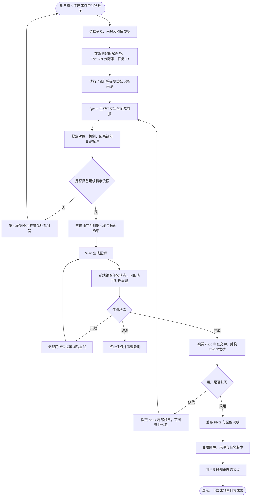
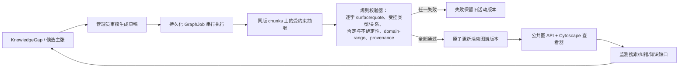

## 🏆 参赛信息
本作品为 **2026年“挑战杯”揭榜挂帅擂台赛（阿里云赛道·题目编号XH-202619）** 参赛作品，归属「赛道三：科普科教与艺术表达-科学传播的多元艺术表达」方向。

### 参赛合规说明
1. **基座模型合规**：核心推理模型采用 Qwen 3.8-flash，图像生成模型采用 Wan 2.7-image-pro，均为千问（Qwen）系列开源模型，符合赛事基座模型要求。
2. **平台调用合规**：模型服务通过**阿里云百炼平台**调用，项目算力支持来自阿里云「云工开物」学生算力权益，符合赛事平台使用要求。
3. **交付说明**：仓库采用“源码 + 功能级可复现脚本”交付：bootstrap 从官方源下载固定版本 BGE 模型，并由受治理语料在本机重建 Hybrid RAG；不分发生产 active 索引、Graph snapshot 或历史生成素材。

# 疫苗防线：可追溯的疫苗科普与交互表达平台

面向"挑战杯"科学传播方向的可演示全栈项目：以受治理的本地 RAG 与受限 PubMed 核验支撑疫苗问答，将抽象免疫机制转化为科学图解、互动闯关与公共卫生模拟，并通过人工审核与版本化知识图谱形成可追溯的知识更新闭环。

> 🌐 **在线体验：** https://skin-swimming-shades-assume.trycloudflare.com/ （Cloudflare 隧道实时演示；隧道重启后地址可能更新，以最新交付材料为准）

> 📋 **能力边界：** 本项目用于健康科普与科学传播，不提供个体化诊疗或接种决策；具体接种安排以当地疾控机构与专业人员最新建议为准。GraphRAG 已启用（`GRAPH_RAG_ENABLED=true`）：140 份受治理语料文档（125 PDF + 11 MD + 4 DOCX）构建为 17,167 个 chunks，活动图谱版本含 8,006 节点、6,215 边、5,282 条 provenance；图缺失或版本不匹配时问答自动回退 Vector-only。视频页为本地模拟交互，不宣称真实视频生成。

---

## 一、五个模块、五个闭环

系统不是"模型回答 + 页面展示"的拼接，而是五个可独立审查、彼此衔接的闭环：证据不足不硬答，生成结果不直接采信，知识更新必须经人工审核与原子发布。

### 1. 问答闭环（问题 → 检索 → 证据评估 → 回答与来源）


要点：

- 主回答只能基于**当轮独立 V2 检索**，改写 query 与历史消息不得充当医学证据；
- `sources` 只能来自当轮本地检索或外部 PubMed，PDF 页码为 1-based，无证据时返回空数组；
- 证据不足且 PubMed 无结果时返回受限初步科普，不捏造剂次、年龄、禁忌或来源。

### 2. 图解闭环（科学 brief → Wan 生成 → 视觉审查 → 局部编辑）

用户主题先由 Qwen 整理为受约束的中文科学简报（对象、机制、因果链、标注），再交 Wan 生成；输出经视觉 critic 审查文字、结构与科学表达，用户可确认采用，或提交受 bbox 范围守护的局部修改（模型只见外扩裁剪，只有向内羽化的用户 bbox 可写，回贴时越界像素被拒绝）。



### 3. 互动闭环（免疫闯关 + 公共卫生沙盘）

体验一为五关卡免疫叙事（抗原捕获、抗原呈递、B 细胞激活、记忆召回等，含迷宫寻路与注视追踪）；体验二为参数化公共卫生模拟（覆盖率、传播风险与资源配置规则）。规则、科学表达与展示效果经自动化测试与人工复核后迭代。

### 4. 知识治理与图谱闭环（候选主张 → 人工审核 → 原子发布）

当前活动图谱版本 `graph-20260824T032039458153Z-7a0729a2-2558bd4d`：基于 17,167 个 chunks 构建的 8,006 节点 / 6,215 边 / 5,282 条 provenance，全部通过 `medical_graph_validator_v10` 校验后原子发布，并通过 GraphRAG 在问答中提供图上下文。



要点：

- PubMed 是当轮只读外部来源，**绝不自动写入** RAG 或图谱；
- 管理员审批只生成草稿，发布由持久化任务串行执行，全部校验成功后才原子切换；
- 图谱快照必须绑定同版索引，缺失或版本不匹配时公共图 API 返回 503，问答安全退回 Vector-only。

### 5. 前端体验闭环（React 状态与服务层 → 异常/取消处理 → 人工验收）

所有网络代码收敛在 `frontend/src/services/`；图解任务使用 request token + job ID + AbortController，切换、取消、卸载时对称清理 timer、轮询、监听、observer、GSAP 与请求；同步维护键盘可达、移动端、reduced-motion 等可访问性要求。

---

## 二、系统架构

| 层级 | 组件 | 责任边界 |
| --- | --- | --- |
| 前端 | React 19 + TypeScript + Vite + Cytoscape/GSAP | 只调用同源 `/api/v1`；跨面板状态在 `App.tsx` |
| API | FastAPI 应用工厂、`/api/v1` router、lifespan | 路由只做 HTTP/依赖/稳定错误映射；共享客户端由 lifespan 创建 |
| 问答 | `RagService`、`QwenService`、`EvidenceAssessmentService` | 主回答看到原问题；来源只能由当轮检索/外部文献产生 |
| 知识 | `RAG/` 语料（140 份文档 → 17,167 个 chunks）、manifest、versioned candidate、`active.json` | 运行时只读本地模型与索引；不自动下载或重建 |
| 治理 | KnowledgeGap、管理员 session/CSRF、SQLite GraphJob | 只允许人工批准、人工发布；失败保留旧活动版本 |
| 图解 | ImageJob、organizer、Wan、critic、scope guard | 单活动内存任务；取消、轮询和请求对称清理 |
| 图谱 | graph worker、validator、snapshot、public store | 唯一输入为同版 Vector candidate chunks |

## 三、模型与规则分工

| 组件 | 角色 | 强制边界 |
| --- | --- | --- |
| Qwen `qwen3.8-flash` | 路由、追问恢复、证据评估、受证据约束回答、PubMed 工具编排、图解 brief、视觉审查、图谱候选抽取 | 不生成来源；不绕过证据给具体医学结论；不自动批准或发布 |
| Wan `wan2.7-image-pro` | 科学图解生成与受 bbox 限制的局部编辑 | 不作为科学事实判定器；输出必须经审查与用户确认 |
| BGE embedding + BM25 | Dense 召回与中文词法召回 | 不生成语言或医学结论 |
| RRF + CrossEncoder | 融合并重排有限候选 | 不替代人工审核、来源 provenance 或版本校验 |
| 图谱规则验证器 | 同 chunk 逐字证据校验 | 无法确认时宁可拒绝；不用自动 NER/fuzzy merge 绕过校验 |

## 四、仓库结构

```
├── frontend/            React 19 + TypeScript 前端（src/ 为业务源码与组件测试）
├── backend/             FastAPI 后端
│   ├── app/             api routes / services / rag / graph / pubmed / schemas / admin
│   ├── tests/           离线测试套件（含 RAG X2 回归与 evaluator 完整性测试）
│   ├── assets/          图解管线运行参考图
│   └── runtime/  rag_index/  model_cache/  generated_images/   # 本机生成的运行时资产，不入库
├── RAG/                 受治理语料：140 份文档（125 PDF + 11 MD + 4 DOCX）+ corpus_manifest.jsonl 准入清单
├── skills/              受治理细胞 IP 图解技能（图解管线启动校验依赖）
├── nginx/  docker-compose.yml  Dockerfile×2
├── assets/              runtime-assets-manifest.json（固定上游模型 revision）
├── scripts/             bootstrap_assets.py / rebuild_rag_index.py / verify_assets.py
└── dev.ps1              本地一键启动前后端
```

## 五、快速开始

本地开发（Windows）：

```powershell
# 1. 配置后端密钥
copy backend\.env.example backend\.env   # 填入 DASHSCOPE_API_KEY 等

# 2. 恢复本机功能级 RAG 资产（首次会安装后端 helper 依赖、下载固定 BGE revision 并重建索引）
python scripts\bootstrap_assets.py

# 3. 前端
cd frontend; pnpm install; pnpm dev      # http://localhost:5173

# 4. 后端（另开终端，或直接运行 dev.ps1 一键启动）
cd backend; python -m venv .venv; .venv\Scripts\pip install -e ".[dev]"
.venv\Scripts\uvicorn app.main:app --port 8000
```

Docker 一键部署：

```bash
python3 scripts/bootstrap_assets.py
python3 scripts/deploy_preflight.py --source-only
docker compose up -d --build
# 前端 http://<host>/，后端健康检查 /api/v1/health
```

> **功能级一键复现：** 核心 Hybrid RAG 已在隔离 clean-clone 云端环境完成端到端功能级复现验证。项目提供固定模型 revision、自动准备解析产物，并可由仓库语料在本地重建 Hybrid RAG V2。模型从官方源获取；生产 active RAG/Graph snapshot 不公开。Graph 缺失时安全降级。复现范围与验收记录见 [REPRODUCIBILITY.md](docs/REPRODUCIBILITY.md)。

## 六、RAG V2 X2 冻结正式评测

当前推荐引用的是冻结 1000 条测试集上的 **Top-4 chunk recall：815 / 1000 = 81.5%**。同一测试集与指标定义下，迁移前 baseline 为 **669 / 1000 = 66.9%**，X2 净增加 146 个命中，提升 **+14.6 percentage points**。

命中规则是：生产检索链路最终选出的前 4 个 chunk 中，至少一个 `chunk_id` 属于该问题预先冻结的可接受 gold chunk 集合。它衡量 evidence chunk 是否进入 Top-4，不是回答准确率、医学正确率或整个 RAG 系统的总体准确率。

X2 是 recall-oriented 配置：Dense/BM25 各取 50，RRF/fusion 与 plain rerank 深度为 60，使用 512-token 邻接窗口重打分、`max(plain, window)` 合并、候选池内 ±1 邻接平滑、质量先验，以及 soft cap=3 的 diversity-first 选择。CPU 正式评测平均延迟约 39 秒，因此不得把该配置描述为低延迟方案。

仓库公开冻结测试集、gold、原始结果、原始 trace、全部失败案例、指标定义、配置快照、冻结 manifest、baseline 与 evaluator，供第三方离线复算和审计。正式结果来自冻结实验运行，目标仓库没有重新筛选测试集或重跑 1000 条评测。详见 [RAG V2 评测证据](docs/evaluation/rag_v2/README.md)。

历史记录中的 `1081 条 / 88.62%` 来自另一套数据集和筛选口径，只保留为历史结果，不能与本次冻结 1000 条横向比较。调参阶段的 dev-500 包含全部 331 个 baseline miss 与 169 个抽样 hit，并非独立未知 holdout。

完整评测总览与图解评测、自动化测试基线见 [docs/evaluation.md](docs/evaluation.md)。

## 七、质量基线

- 后端：`pytest` 与 `ruff check app tests` 通过（最新实测数量见 RAG V2 迁移验证记录）
- 前端：59 个测试文件、348 项测试通过；`pnpm build` 通过
- CI：GitHub Actions 持续执行前端测试与构建、后端测试与 lint，以及 Docker 构建验证，配置见 `.github/workflows/ci.yml`。
