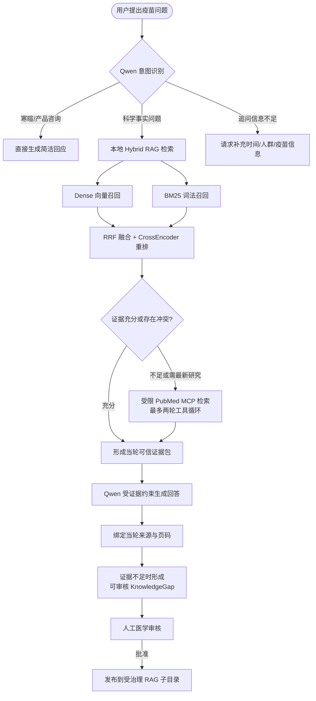
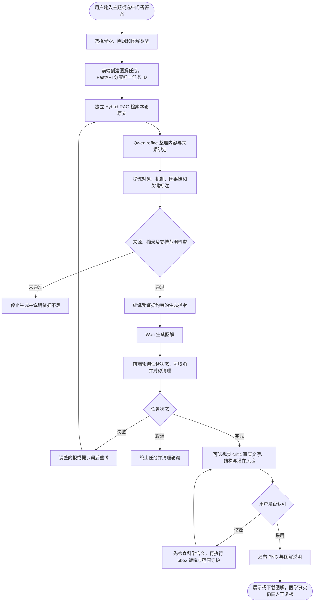
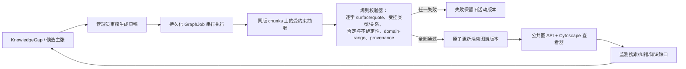

## 🏆 参赛信息
本作品为 **2026年“挑战杯”揭榜挂帅擂台赛（阿里云赛道·题目编号XH-202619）** 参赛作品，归属「赛道三：科普科教与艺术表达-科学传播的多元艺术表达」方向。

### 参赛合规说明
1. **模型使用说明**：默认推理模型为 Qwen 3.8-flash，图像模型为 Wan 2.7-image-pro，通过百炼调用。Wan 属于通义万相；不将这些托管服务型号等同于已公开权重的开源模型。赛事合规需结合具体模型与赛事要求核验。
2. **平台调用合规**：模型服务通过**阿里云百炼平台**调用，项目算力支持来自阿里云「云工开物」学生算力权益，符合赛事平台使用要求。
3. **交付说明**：仓库采用“源码 + 功能级可复现脚本”交付：bootstrap 从官方源下载固定版本 BGE 模型，并由受治理语料在本机重建 Hybrid RAG；不分发生产 active 索引、Graph snapshot 或历史生成素材。

# 疫苗防线：可追溯的疫苗科普与交互表达平台

面向"挑战杯"科学传播方向的可演示全栈项目：以受治理的本地 RAG 与受限 PubMed 核验支撑疫苗问答，将抽象免疫机制转化为科学图解、互动闯关与公共卫生模拟，并通过人工审核与版本化知识图谱形成可追溯的知识更新闭环。

> 🌐 **正式网址：** https://www.yimiaozhihui.cn/
>
> **备用地址：**
> - http://118.31.227.194/ （HTTP 直连）
> - https://skin-swimming-shades-assume.trycloudflare.com/ （Cloudflare 临时隧道；隧道重启后地址可能更新）

> 📋 **能力边界：** 本项目用于健康科普与科学传播，不提供个体化诊疗或接种决策。语料清单共 141 条（含 4 份下载占位文档），不等于活动索引实际收录量。历史部署记录为 17,167 个 chunks、8,006 个图节点与 6,215 条边；生产索引和图快照不随 Git 发布，当前线上状态需另行核验。代码默认 `GRAPH_RAG_ENABLED=false`，图缺失或版本不匹配时问答回退 Vector-only。
>
> **科普视频观看：** 两集短片可在 [线上演示网站](https://www.yimiaozhihui.cn/) 的“科普短视频”入口观看。因视频文件较大，源码仓库仅附封面；本地部署需按 [DEPLOYMENT.md](DEPLOYMENT.md) 补充 MP4。该入口播放预制短片，不提供实时视频生成。

---

## 一、五个模块、五个闭环

系统不是"模型回答 + 页面展示"的拼接，而是五个可独立审查、彼此衔接的闭环：证据不足不硬答，生成结果不直接采信，知识更新必须经人工审核与原子发布。

### 1. 问答闭环（问题 → 检索 → 证据评估 → 回答与来源）


```mermaid
flowchart TB
    user([用户提出疫苗问题]) --> router{Qwen 意图识别}
    router -->|寒暄/产品咨询| direct[直接生成简洁回应]
    router -->|科学事实问题| rag[本地 Hybrid RAG 检索]
    router -->|追问信息不足| clarify[请求补充时间/人群/疫苗信息]

    rag --> dense[Dense 向量召回]
    rag --> bm25[BM25 词法召回]
    dense --> rrf[RRF 融合 + CrossEncoder 重排]
    bm25 --> rrf
    rrf --> assess{证据充分或存在冲突?}

    assess -->|不足或需最新研究| pubmed[受限 PubMed MCP 检索<br/>最多两轮工具循环]
    assess -->|充分| pack[形成当轮可信证据包]
    pubmed --> pack
    pack --> answer[Qwen 受证据约束生成回答]
    answer --> sources[绑定当轮来源与页码]
    sources --> gap[证据不足时形成<br/>可审核 KnowledgeGap]
    gap --> review[人工医学审核]
    review -->|批准| publish[发布到受治理 RAG 子目录]
```

要点：

- 主回答只能基于**当轮独立 V2 检索**，改写 query 与历史消息不得充当医学证据；
- `sources` 只能来自当轮本地检索或外部 PubMed，PDF 页码为 1-based，无证据时返回空数组；
- 证据不足且 PubMed 无结果时返回受限初步科普，不捏造剂次、年龄、禁忌或来源。

### 2. 图解闭环（独立检索 → 来源绑定 → Wan 生成 → 视觉审查）

正式任务独立调用现有本地 Hybrid RAG，Qwen 依据本轮原文整理 brief，每项科学表述和因果步骤均须绑定真实来源编号与逐字摘录。后端核对覆盖、来源身份、数字及单位，并单独检查支持范围；无依据、格式无效或支持检查失败时停止，不调用 Wan。生成、视觉审查及编辑沿用同一证据契约；前端展示表述、原文、来源链接和页码/条款。**来源绑定及模型辅助检查不等于医学审核通过，医学内容仍需人工复核。** 本轮未做收费生图评测，图解尚未接 PubMed 外部检索。详见 [改造记录](docs/science-image-grounding-2026-10-08.md)。


```mermaid
flowchart TB
    accTitle: 科学图解运行工作流
    accDescr: 正式任务从主题输入、Qwen 简报到 Wan 生成，可选视觉审核及用户框选编辑；先独立检索并绑定来源，缺少支持时停止生成。

    user([用户输入主题或选中问答答案]) --> choose[选择受众、画风和图解类型]
    choose --> create_job[前端创建图解任务，FastAPI 分配唯一任务 ID]
    create_job --> evidence[独立 Hybrid RAG 检索本轮原文]
    evidence --> qwen_brief[Qwen refine 整理内容与来源绑定]
    qwen_brief --> extract[提炼对象、机制、因果链和关键标注]
    extract --> binding{来源、摘录及支持范围检查}
    binding -->|未通过| stop[停止生成并说明依据不足]
    binding -->|通过| prompt_design[编译受证据约束的生成指令]

    prompt_design --> wanxiang[Wan 生成图解]
    wanxiang --> poll[前端轮询任务状态，可取消并对称清理]
    poll --> status{任务状态}
    status -->|失败| retry[调整简报或提示词后重试]
    retry --> evidence
    status -->|取消| cancel[终止任务并清理轮询]
    status -->|完成| quality[可选视觉 critic 审查文字、结构与潜在风险]

    quality --> approve{用户是否认可}
    approve -->|修改| edit[先检查科学含义，再执行 bbox 编辑与范围守护]
    edit --> quality
    approve -->|采用| publish[发布 PNG 与图解说明]
    publish --> result([展示或下载图解，医学事实仍需人工复核])
```

### 3. 互动闭环（免疫闯关 + 公共卫生沙盘）

体验一实际实现三个顶层阶段：`LevelOne`（接种与抗原捕获）、`LevelTwo`（迷宫追击与抗原呈递）、`LevelThree`（淋巴细胞协作、B 细胞激活与记忆召回）。早期“五关卡”是叙事设计，不是当前五个独立 stage。体验二为简化的传播模拟，可调整人数、接种比例、疫苗效力、初始患病比例、感染概率、保持距离比例和死亡概率；尚无资源配置模型。所有参数用于机制示意，不用于预测真实疫情或决定接种。

### 4. 知识治理与图谱闭环（候选主张 → 人工审核 → 原子发布）

历史部署记录的图谱版本为 `graph-20260824T032039458153Z-7a0729a2-2558bd4d`（8,006 节点 / 6,215 边 / 5,282 条 provenance）。这些数字是历史快照记录；clean clone 不含该快照，不能据此承诺开箱即展示同一图谱。规则校验通过也不等于医学准确率验收。


```mermaid
flowchart LR
    gap[KnowledgeGap / 候选主张] --> draft[管理员审核生成草稿]
    draft --> job[持久化 GraphJob 串行执行]
    job --> extract[同版 chunks 上的受约束抽取]
    extract --> validate[规则校验器：<br/>逐字 surface/quote、受控类型/关系、<br/>否定与不确定性、domain-range、provenance]
    validate -->|任一失败| keep[失败保留旧活动版本]
    validate -->|全部通过| atomic[原子更新活动图谱版本]
    atomic --> api[公共图 API + Cytoscape 查看器]
    api --> monitor[监测搜索/纠错/知识缺口]
    monitor --> gap
```

要点：

- PubMed 是当轮只读外部来源，**绝不自动写入** RAG 或图谱；
- 管理员审批只生成草稿，发布由持久化任务串行执行，全部校验成功后才原子切换；
- 图谱快照必须绑定同版索引，缺失或版本不匹配时公共图 API 返回 503，问答安全退回 Vector-only。

### 5. 前端体验闭环（React 状态与服务层 → 异常/取消处理 → 人工验收）

所有网络代码收敛在 `frontend/src/services/`；图解任务使用 request token + job ID + AbortController，切换、取消、卸载时对称清理 timer、轮询、监听、observer、GSAP 与请求；同步维护键盘可达、移动端、reduced-motion 等可访问性要求。

---

## 二、系统架构

| 层级 | 组件 | 责任边界 |
| --- | --- | --- |
| 前端 | React 19 + TypeScript + Vite + Cytoscape/GSAP | 只调用同源 `/api/v1`；跨面板状态在 `App.tsx` |
| API | FastAPI 应用工厂、`/api/v1` router、lifespan | 路由只做 HTTP/依赖/稳定错误映射；共享客户端由 lifespan 创建 |
| 问答 | `RagService`、`QwenService`、`EvidenceAssessmentService` | 主回答看到原问题；来源只能由当轮检索/外部文献产生 |
| 知识 | `RAG/` 清单（141 条，含下载占位）、manifest、versioned candidate、`active.json` | 运行时只读本地模型与索引；实际收录量以活动索引为准 |
| 治理 | KnowledgeGap、管理员 session/CSRF、SQLite GraphJob | 只允许人工批准、人工发布；失败保留旧活动版本 |
| 图解 | ImageJob、organizer、Wan、critic、scope guard | 单活动内存任务；取消、轮询和请求对称清理 |
| 图谱 | graph worker、validator、snapshot、public store | 唯一输入为同版 Vector candidate chunks |

## 三、模型与规则分工

| 组件 | 角色 | 强制边界 |
| --- | --- | --- |
| Qwen `qwen3.8-flash` | 路由、追问恢复、证据评估、受证据约束回答、PubMed 工具编排、图解 brief、视觉审查、图谱候选抽取 | 不生成来源；不绕过证据给具体医学结论；不自动批准或发布 |
| Wan `wan2.7-image-pro` | 科学图解生成与受 bbox 限制的局部编辑 | 不作为科学事实判定器；输出必须经审查与用户确认 |
| BGE embedding + BM25 | Dense 召回与中文词法召回 | 不生成语言或医学结论 |
| RRF + CrossEncoder | 融合并重排有限候选 | 不替代人工审核、来源 provenance 或版本校验 |
| 图谱规则验证器 | 同 chunk 逐字证据校验 | 无法确认时宁可拒绝；不用自动 NER/fuzzy merge 绕过校验 |

## 四、仓库结构

```
├── frontend/            React 19 + TypeScript 前端（src/ 为业务源码与组件测试）
├── backend/             FastAPI 后端
│   ├── app/             api routes / services / rag / graph / pubmed / schemas / admin
│   ├── tests/           离线测试套件（含 RAG X2 回归与 evaluator 完整性测试）
│   ├── assets/          图解管线运行参考图
│   └── runtime/  rag_index/  model_cache/  generated_images/   # 本机生成的运行时资产，不入库
├── RAG/                 语料清单 141 条（125 PDF + 12 MD + 4 DOCX，含 4 份下载占位）
├── skills/              受治理细胞 IP 图解技能（图解管线启动校验依赖）
├── nginx/  docker-compose.yml  Dockerfile×2
├── assets/              runtime-assets-manifest.json（固定上游模型 revision）
├── scripts/             bootstrap_assets.py / rebuild_rag_index.py / verify_assets.py
└── dev.ps1              本地一键启动前后端
```

## 五、快速开始

本地开发（Windows）：

```powershell
# 1. 配置后端密钥
copy backend\.env.example backend\.env   # 填入 DASHSCOPE_API_KEY 等

# 2. 恢复本机功能级 RAG 资产（首次会安装后端 helper 依赖、下载固定 BGE revision 并重建索引）
python scripts\bootstrap_assets.py

# 3. 前端
cd frontend; pnpm install; pnpm dev      # http://localhost:5173

# 4. 后端（另开终端，或直接运行 dev.ps1 一键启动）
cd backend; python -m venv .venv; .venv\Scripts\pip install -e ".[dev]"
.venv\Scripts\uvicorn app.main:app --port 8000
```

Docker 一键部署：

```bash
python3 scripts/bootstrap_assets.py
python3 scripts/deploy_preflight.py --source-only
docker compose up -d --build
# 前端 http://<host>/，后端健康检查 /api/v1/health
```

> **功能级一键复现：** 核心 Hybrid RAG 已在隔离 clean-clone 云端环境完成端到端功能级复现验证。项目提供固定模型 revision、自动准备解析产物，并可由仓库语料在本地重建 Hybrid RAG V2。模型从官方源获取；生产 active RAG/Graph snapshot 不公开。Graph 缺失时安全降级。复现范围与验收记录见 [REPRODUCIBILITY.md](docs/REPRODUCIBILITY.md)。

## 六、RAG 检索评测与可复核性

项目提交报告采用的 RAG 检索评测先构建 1500 条独立疫苗知识测试问题，并依据当时本地知识库的语料覆盖范围进行适用性筛查。其中 419 条因知识库中不存在足以支持核心答案的对应证据，被作为 Knowledge Gap 排除；最终 1081 条进入 Top-4 检索评测，其中 958 条成功召回正确证据：

**958 / 1081 = 88.62%**

这是项目正式提交报告采用的检索评测指标。命中表示前 4 条检索结果中至少存在能够支撑问题核心事实的正确 evidence；该指标评价检索层表现，不等同于最终回答准确率、医学正确率、大语言模型回答准确率、知识库总体覆盖率或所有用户问题的成功率。报告口径的方法、汇总指标与 15 条公开脱敏样例见 [评测总览](docs/evaluation.md) 和 [rag_retrieval_samples.json](docs/evaluation/rag_retrieval_samples.json)。

### 额外冻结复核 benchmark

为进一步增强真实性、透明度、可追溯性及第三方审计能力，项目后续另建立并冻结了一套 RAG V2 X2 1000 条复核 benchmark。它完整公开 evaluation cases、gold labels、metric definition、config snapshot、freeze manifest、全部 1000 条 raw results、全部 1000 条逐阶段 raw traces、全部 185 个 Top-4 miss、同集 baseline、formal run state、consistency report、evaluator、porting verification，以及 commit、index 与 SHA256 身份，可由第三方离线独立复算和逐题审查。

在该冻结 1000 条测试集及其统一 gold / metric definition 下：

- baseline：669 / 1000 = 66.9%
- X2：815 / 1000 = 81.5%
- 同集提升：+146 hits / +14.6 percentage points

X2 是 recall-oriented 配置：Dense/BM25 各取 50，fusion 与 plain rerank 深度为 60，使用 512-token 邻接窗口重打分、`max(plain, window)` 合并、候选池内 ±1 邻接平滑、质量先验，以及 soft cap=3 的 diversity-first 选择。CPU 正式评测平均延迟约 39 秒，因此不能描述为低延迟配置。完整原始证据与复算说明见 [RAG V2 X2 冻结评测目录](docs/evaluation/rag_v2/README.md)。

**样本集中度限制：** 1000 条问题的 `acceptable_gold_chunk_ids` 合计只有 220 个不同切片；4000 个 Top-4 检索项涉及 543 个不同切片。该 benchmark 围绕有限证据片段构造，dev-500 又参与过调参，不能据此证明跨文档、未知主题或高风险医学问题的泛化能力。

### 两套结果的关系

项目报告的 `1081 条 / 88.62%` 与冻结复核 benchmark 的 `1000 条 / 81.5%` 并非同一测试集上的前后版本成绩。二者的数据集构造、样本筛选/冻结协议与评测用途不同，因此不能直接横向比较；81.5% 不表示系统从 88.62% 下降，也不用于替代项目报告中的 88.62%。

- **88.62%**：项目提交报告采用的 Top-4 evidence retrieval 结果。
- **81.5%**：仓库额外公开完整 raw-level 证据链后的冻结复核 benchmark 结果。

冻结 benchmark 内的 66.9% baseline 与 +14.6 percentage points 提升只用于该 1000 条同集、同 gold、同指标定义的严格比较。

## 七、质量基线

2026-10-09 本次本地离线验证；测试数量随提交与参数化变化，后续以对应提交的实际测试或 CI 输出为准。

- 后端：440 项 `pytest` 通过（2 个第三方 deprecation warnings；含图解来源绑定、取消、重试及编辑守护回归）；`ruff check app tests` 通过
- 前端：62 个测试文件、363 项测试通过；`pnpm build` 通过
- `python scripts/deploy_preflight.py --source-only` 通过；本次未调用真实模型或重建索引/图谱
- CI：GitHub Actions 持续执行前端测试与构建、后端测试与 lint，以及 Docker 构建验证，配置见 `.github/workflows/ci.yml`。

## 八、科学证据与交付限制

2026-10-08 补充狂犬病规范后，当前清单仍有：98/141 条 `evidence_level=unknown`，117/141 条 `metadata_confidence=low`，117/141 条缺少 `publication_date`，120/141 条语言为英文。部分 `issuer` 来自 PDF 作者元数据，不能视作发布机构。受治理表示有清单和准入流程，不代表元数据已全部人工核实。

当前20条科学正确性抽检已完成导师人工审核，评分为20/20科学正确、19/20引用支持、0/20严重医学错误、20/20安全边界通过；这些数字只描述本次样本。SCI-013使用已独立评分并绑定正文及来源的新返回，其余19条使用原输出与人工判定，每题只计一次。运行和评分对应见 [样本版本](docs/evaluation/scientific_correctness/sample_selection.json)、[人工复核表](docs/evaluation/scientific_correctness/human_review.csv)与[抽检报告](docs/evaluation/scientific_correctness/report.md)。旧输出归档保留，生产活动索引未切换。
